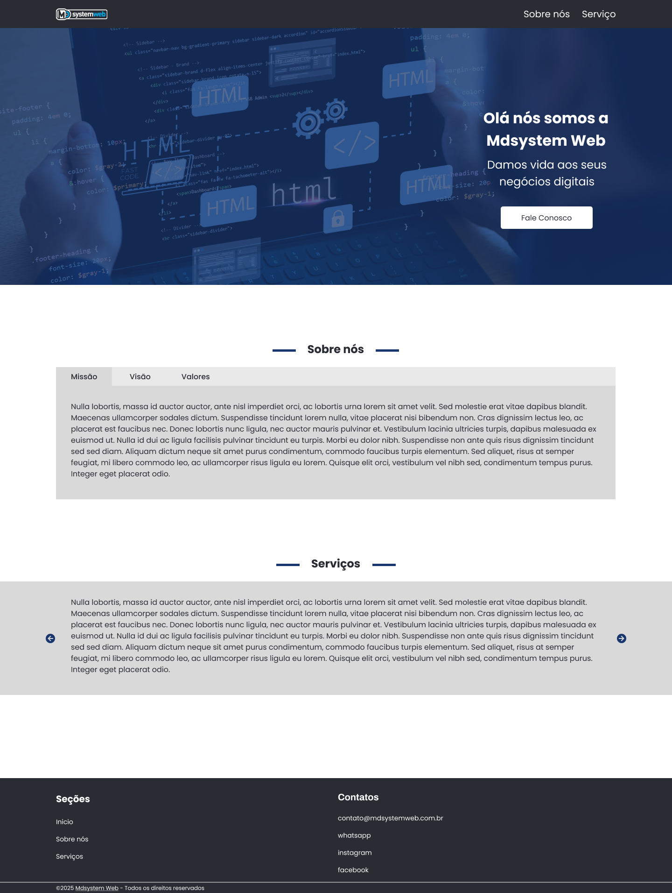

# Quer ser desenvolvedor frontend na MDsystem Web?
Criamos este teste para avaliar seus conhecimentos e habilidades frontend (HTML, CSS e JavaScript).

## O teste
O desafio é tornar o layout abaixo em uma página funcional. 
Não existe certo ou errado, queremos ver como você se sai em situações reais, como este desafio.

Portanto, dê o seu melhor!

:warning: **OBS:** Os layouts podem ser encontrados no figma **layout**




## Instruções
- O conteúdo não é estático. Você deve fazer consulta a API.
- URL API
    - https://www.mdsystemweb.com.br/projects/api/v1/test/layout.php
- Fonte padrão: "Poppins".
- No CSS usar (Flex box).
- Crie uma documentação simples comentando sobre as tecnologias e soluções adotadas.
- Realize o desenvolvimento dentro da pasta src

## Requisitos
- Design responsivo nos breakpoints, mobile first
- Suporte para IE, Chrome, Safari, Firefox

## Diferenciais
- Uso de pré-processador CSS (Sass)

## O que será avaliado
- Estrutura e organização do código e dos arquivos
- Soluções adotadas
- Qualidade
- Fidelidade ao layout
- Enfim, tudo será observado e levado em conta

## Como iniciar o desenvolvimento
- Node v20.18.1
- Fork este repositório na sua conta do Github
- Crie uma branch com o nome **desafio**
- Instale as dependências
```
yarn
```
- Rode a aplicação
```
yarn start
```
- Acesse http://localhost:4000

## Como enviar seu teste
- Envie um email para [diogo.alves@mdsystemweb.com.br] com o link do seu repositório
- Se o seu repositório for privado, solicite os emails das pessoas responsáveis para conceder acesso de leitura ao seu repositório.
